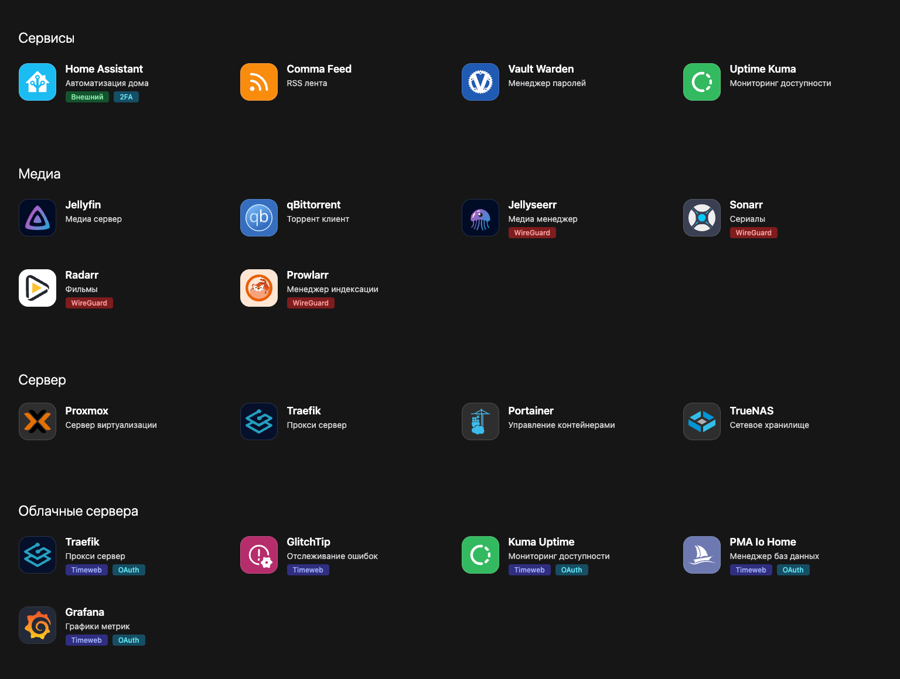

# Примеры пользователей

## Добавить свой пример

Для добавления своего примера создайте issue на github. Заполните все поля, после чего ожидайте добавления.
Для других пользователей будет очень полезно, если вы поделитесь вашим `config.yml` (предварительно удалив `secrets` есть они есть).

[Отправить свой пример](https://github.com/hywax/mafl/issues/new?assignees=&labels=showcase&projects=&template=showcase.yml&title=%5BSHOWCASE%5D+%3Ctitle%3E)

## splnut

От [@splnut](https://github.com/splnut) ([#71](https://github.com/hywax/mafl/issues/71))

## hywax

От [@hywax](https://github.com/hywax)

